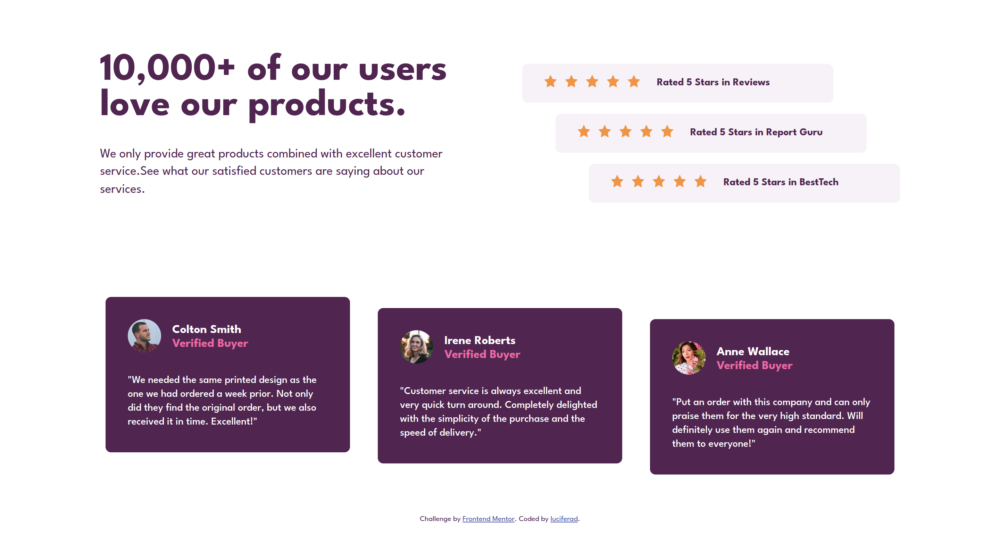

# Frontend Mentor - Social proof section solution

This is a solution to the [Social proof section challenge on Frontend Mentor](https://www.frontendmentor.io/challenges/social-proof-section-6e0qTv_bA). Frontend Mentor challenges help you improve your coding skills by building realistic projects. 

## Table of contents

- [Overview](#overview)
  - [The challenge](#the-challenge)
  - [Screenshot](#screenshot)
  - [Links](#links)
- [My process](#my-process)
  - [Built with](#built-with)
  - [What I learned](#what-i-learned)
  - [Continued development](#continued-development)
  - [Useful resources](#useful-resources)
- [Author](#author)

## Overview

### The challenge

Users should be able to:

- View the optimal layout for the section depending on their device's screen size

### Screenshot



### Links

- Solution URL: [Github](https://github.com/luciferad/social-proof-section-master)
- Live Site URL: [Github](https://luciferad.github.io/social-proof-section-master/)

## My process

### Built with

- Semantic HTML5 markup
- CSS custom properties
- Flexbox
- CSS Grid

### What I learned

To horizontally center a block element (like <div>), use ==margin: auto==. Setting the width of the element will prevent it from stretching out to the edges of its container. The element will then take up the specified width, and the remaining space will be split equally between the two margins

```html
<footer>luciferad</footer>
```
```css
footer {
  margin-left: auto;
  position: absolute;
  bottom: 1%;
}
```
I learned to position a block element in the center of a container with this piece of code:
```html
<body>
  <div class="item"></div>
</body>
```
```css
item {
  position: absolute;
  left: 0;
  right: 0;
  margin-right: auto;
  margin-left: auto;
}
```

### Continued development

I have to learn more about HTML & CSS. I should code more optimized & practice more for better layout.

### Useful resources

- [Learning Web Design](https://www.amazon.com/Learning-Web-Design-Beginners-JavaScript/dp/1491960205) - A great book for begining.
- [W3Schools](https://www.w3schools.com) - A handy reference for learning frontend.

## Author

- Github - [@luciferad](https://github.com/luciferad)
- Frontend Mentor - [@luciferad](https://www.frontendmentor.io/profile/luciferad)